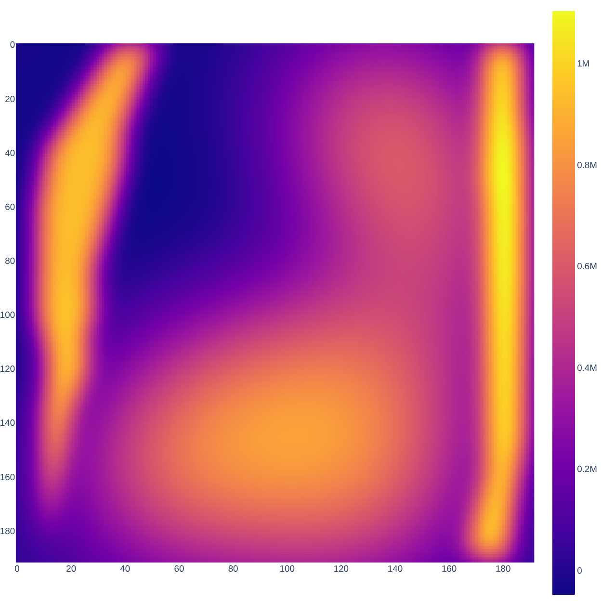
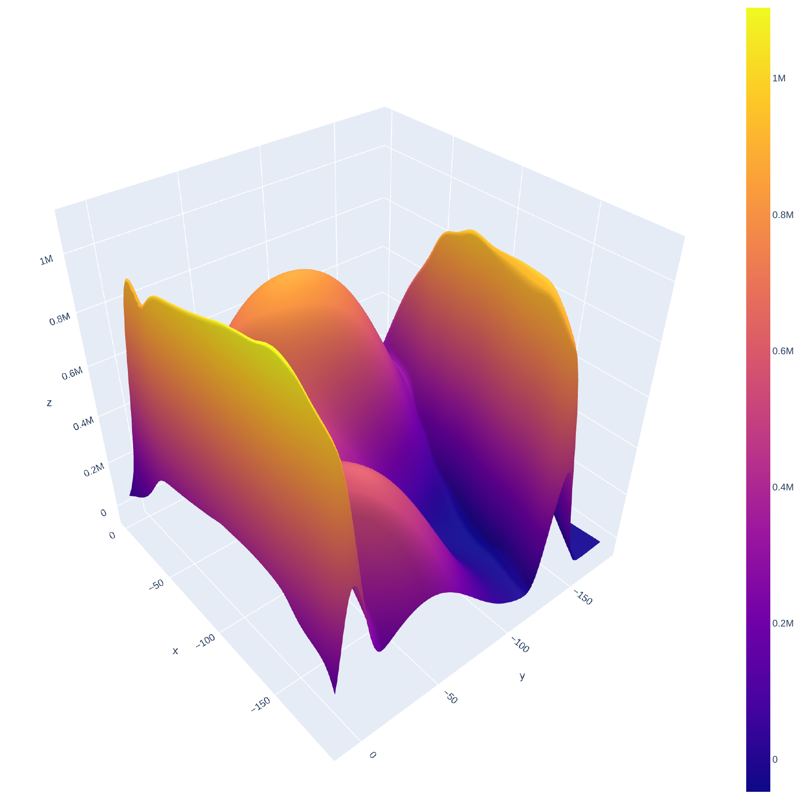
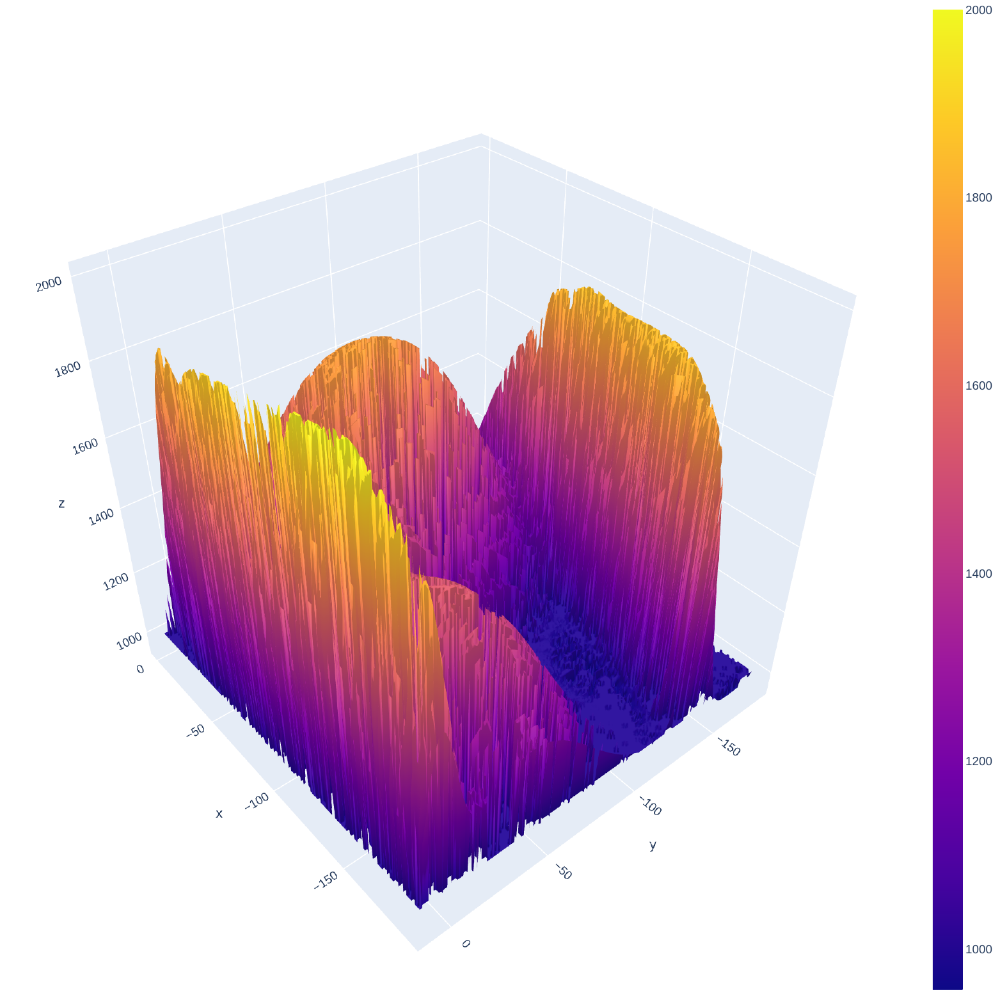

# Context-Dependent Probabilistic Prior Information (CoDePPI)

CoDePPI is a better prior information extraction algorithm that focuses to use motion information from dynamic MRI scans.

This work is part of my [Bachelor's Thesis](https://gabrielziegler3.github.io/publication/codeppi).

<table>
  <tr>
    <td></td>
    <td></td>
    <td></td>
    <td></td>
  </tr>
</table>

## Usage

### Build docker container with

```bash
docker build . -t mri-reconstruction:latest
```

### Spin up the container and run jupyter lab at port 8888

```bash
docker run -it -p 8888:8888 -v `pwd`:/mri-reconstruction --rm --detach --name mri-reconstruction mri-reconstruction
```

### Open up your browser in localhost:8888

```
http://localhost:8888/
```

### Dictionary

* `b (1d array) - refers to the measurements vector`
* `samples_rows (1d array) - refers to the measurements positions in the image matrix`
* `h - oftentimes refers to the (list of) sparsifying filters used`
* `phi (1d array) - similar to samples_rows. Prior information matrix positions`
* `tau (float) - factor to multiply values in phi positions`
